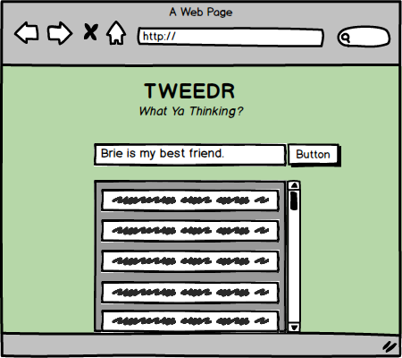

# Project Overview

## Project Description

It is an app similar to the idea of twitter.com and it allows the user to insert their posts - plus, the time of post is inserted automatically with each post. It has a combination of both front and back end. It was built with the group of 4, using Node.js, React, CSS, JSX.

### Wireframe

### Landing Page

### Initialization
- Clone and Install it
- Go to "Tweeder_App/tweedr/db/migrations" and type `psql` and press enter?
- Type `CREATE DATABASE tweedr_dev` to create database and then type `\q` to exit.
- Create the table by typing `psql -f migration.sql` inside the "./migration" folder
- Go back to "Tweeder_App/tweedr" and type `npm install` to install all the dependences for node.js.
- Then do same in "Tweeder_App/tweedr" directory for REACT.
- Type `npm start` inside "Tweeder_App/tweedr" to start the node.js server and inside "Tweeder_App/tweedr/client" to start the React.js server.
- Node.js server is on "http://localhost:3001/" and React.js server is on http://localhost:3000/
